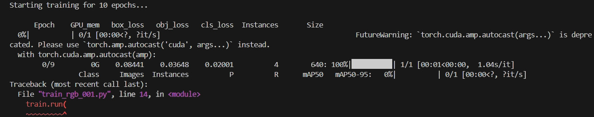

# IR + RGB Fusion with YOLOv5

## 📌 Project Overview

This project explores **object detection using YOLOv5 with fused Infrared (IR) and RGB images**.
The main goal is to implement **early fusion** by combining RGB and IR into a 4-channel input (`[R, G, B, IR]`) and train YOLOv5 to detect objects using both modalities.

I initially considered **YOLOv8** but later decided to implement the approach on **YOLOv5** for easier backbone modifications.

---

## 🗂️ Dataset

* \~100k+ images available, exported via **Roboflow**.
* Each sample has:

  * RGB image
  * IR image (grayscale)
  * COCO-style annotations

Dataset structure follows YOLOv5 format (`images/`, `labels/`) with paired RGB and IR.

---

## 🔧 Modifications

To enable IR+RGB fusion, the following changes were made:

1. **Dataset Loader (`LoadImagesAndLabels`)**

   * Modified `load_image()` to:

     * Read RGB as 3 channels
     * Read IR as grayscale
     * Resize IR to match RGB
     * Concatenate into **4-channel fused image**: `[R, G, B, IR]`
   * Updated `__getitem__()` so augmentations apply correctly to RGB while preserving IR.

2. **Channel Ordering**

   * Fixed YOLOv5 preprocessing (`transpose + BGR2RGB`) so IR stays in the **4th channel** and does not get reversed.

3. **Model Config (`.yaml`)**

   * First convolution updated to accept **4 input channels**:

     ```yaml
     [-1, 1, Conv, [64, 4, 6, 2, 2]]  # 4 channels instead of 3
     ```

---

## ✅ Current Status

* Dataset loads successfully with **IR+RGB fused inputs**.
* Verified that images are **(4, H, W)** tensors with correct channel order.
* Model YAML correctly adjusted for 4-channel input.
* **Training starts but fails at first epoch**, after dataset loading.



---

## ❌ Known Issues

* Training crashes at the beginning of the first epoch.
* Likely causes:

  * Model weight initialization not compatible with 4 channels
  * Data augmentations not fully adapted to handle 4-channel inputs
  * Custom fusion preprocessing may need alignment with loss function

---

## 📚 References

* [YOLOv5 Repository](https://github.com/ultralytics/yolov5)
* Fusion techniques: **MAF-YOLO**, **MHAF-YOLO** (papers)

---
